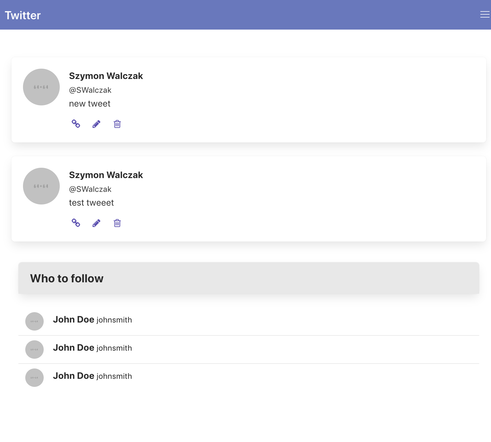
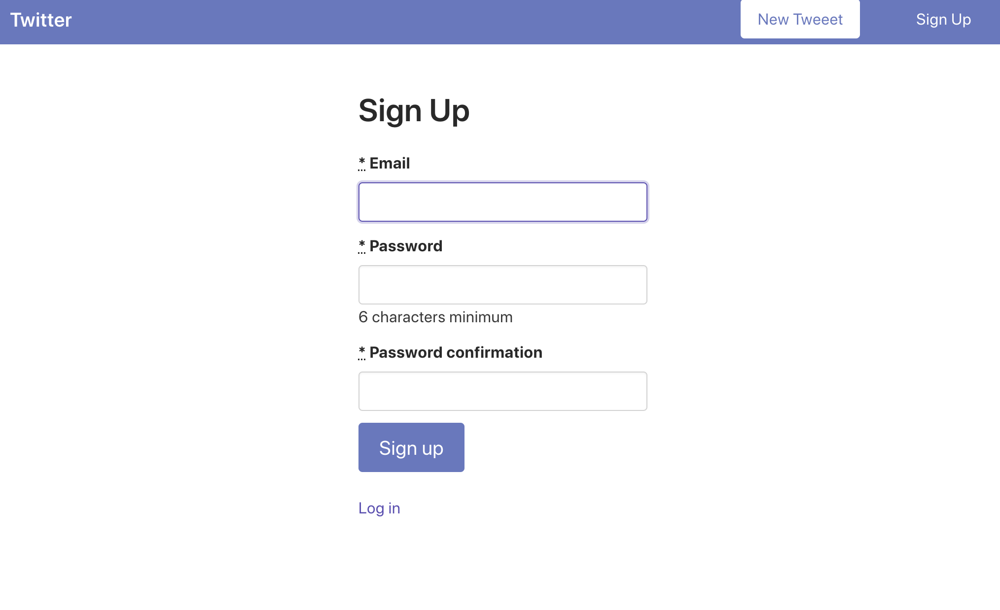

# Twitter clone app. 

What I built by following along to the tutorial.
## Photo of the twitter clone app

- Built using Ruby on Rails 7.0.3.1 and Ruby 3.0.0
- Tutorial URL: https://www.youtube.com/watch?v=5gUysPm64a4&t=2149s

Issues: 
 - It's not responsive.
 - ReadME contains multiple images (for users with slow internet)

How the sign_up_page turned out half-way through the completion of the project.

